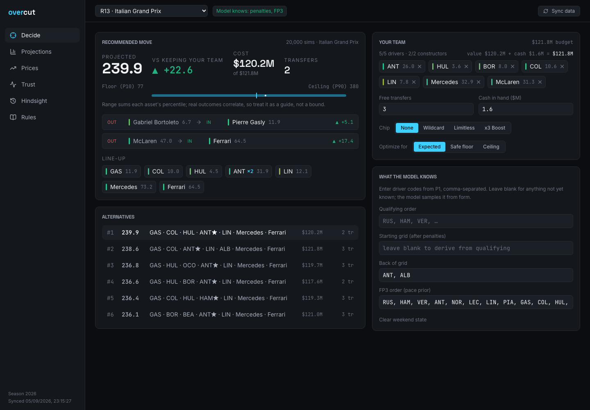

# overcut

An F1 Fantasy analysis toolkit. One binary, a local web app, and a CLI.
No account. No subscription.

overcut answers one question on a race weekend: **given my team, what
should I do this round, and how confident should I be?**



## What it does

- **Decide.** Enter your team, transfers, cash, and chip. The optimizer
  enumerates every legal team — about 1.4 million driver and constructor
  combinations — and returns the provable optimum for the projections,
  with the transfer penalty priced in. It shows the move as out → in with
  the points delta, the Boost, and the floor and ceiling of the result.
- **Project.** A Monte Carlo model simulates the weekend many thousand
  times and gives every asset a full points distribution: mean, P10, P50,
  and P90. Optimize for the expected value, the safe floor, or the ceiling.
- **Know the weekend.** Enter the qualifying order, the starting grid,
  back-of-grid penalties, or the FP3 order. The model uses what it knows
  and samples the rest. The status is visible on every screen.
- **Prices.** A predictor for the next price change, fitted on the season's
  real price moves, with its own measured error and direction hit rate.
- **Trust.** A walk-forward backtest replays the season: fit on earlier
  rounds only, project each round, score against the official points.
  Two naive strategies are scored the same way so the edge is a number.
- **Hindsight.** The best possible team for any finished round.
- **Rules.** The full 2026 scoring rules, rendered from the engine's own
  tables. The tables can be overridden from a JSON file.

## Accuracy, measured

Backtest on the 2026 season, rounds 4–12:

| Metric | Model | Last-round baseline | Season-mean baseline |
| --- | --- | --- | --- |
| Driver points MAE | **11.4** | 15.5 | 12.1 |
| Driver rank correlation (Spearman) | **0.59** | — | — |
| Pre-race optimal team, real points per round | **189** | 139 | 288 (hindsight limit) |

Price predictor: $0.28M mean absolute error and 80% direction hit rate,
walk-forward on 318 real price moves.

The scoring engine reproduces the official qualifying points exactly on
262 of 262 driver-rounds of the 2026 season.

## Use it in the browser

**https://zkrebbekx.github.io/overcut/**

The hosted site runs the same Go engine compiled to WebAssembly, inside a
Web Worker. Nothing leaves your browser. A scheduled workflow refreshes
the season data every six hours and redeploys.

## Install locally

```bash
go install github.com/zkrebbekx/overcut/cmd/overcut@latest
overcut sync          # download the season from public sources
overcut serve         # open http://127.0.0.1:8080
```

## Data store

The whole season lives in one portable file, `data/season2026.json`
(about 20 KB compressed). It holds the calendar, every qualifying,
sprint, and race classification, and every asset's per-gameday price,
ownership, and official points by session. The file is committed, so a
clone works offline and the history of the data is the git history.
`overcut sync` regenerates it from the public sources.

## CLI

```bash
overcut project                                    # next round, all assets
overcut optimize -team "ANT,HUL,BOR,COL,LIN,Mercedes,McLaren" -free 3 -budget 121.8
overcut optimize -back ANT,ALB -fp3 "RUS,HAM,VER,…"  # with known weekend state
overcut optimize -chip 3x                          # chips: wildcard | limitless | 3x
overcut prices
overcut backtest
overcut hindsight -round 12
```

`sync` writes `~/.overcut/season2026.json`. Every other command works
offline from that file and is deterministic for a given seed.

## How the projection works

- **Pace.** Each driver gets a qualifying and a race pace estimate: an
  exponentially weighted average of past positions with a four-round
  half-life, plus a spread fitted from the same data. A known grid blends
  into the race pace.
- **Risk.** Each driver gets a retirement probability, shrunk toward the
  field rate.
- **Components.** Overtake points and driver-of-the-day rates come from the
  official points, not from guesses. The constructor pit-stop component is
  the residual between official constructor points and rule-derived
  points, so a small table difference corrects itself.
- **Simulation.** Each run samples a grid, retirements, a finish order,
  overtakes, the fastest lap, and the driver-of-the-day vote, and scores
  the sample with the official rules. Sprint weekends simulate the sprint
  leg too.

## Data

Two public sources, no authentication:

- Race classifications from the Jolpica F1 API.
- Prices, ownership, and official fantasy points from the F1 Fantasy
  game's public feed.

## Development

```bash
go test ./...
cd web/app && npm install && npm run dev     # UI with API proxy to :8080
cd web/app && npm run build                  # refresh the embedded UI
```

The UI is React + Vite + Tailwind, embedded into the Go binary from
`web/dist`. Design notes live in `docs/DESIGN.md`.

## License

MIT
